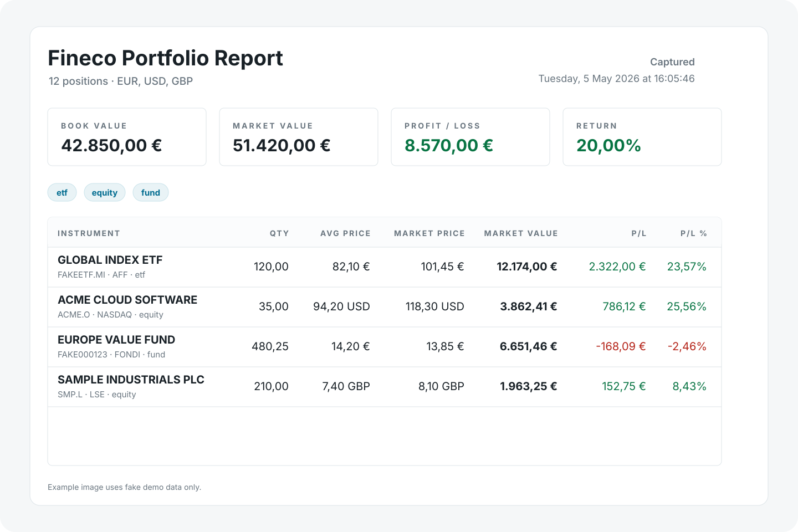

# fineco-helper

A small local helper for read-only Fineco portfolio and market data. It can export your portfolio as JSON, CSV, raw API JSON, a clean HTML report, or shareable reports that hide actual values. It can also search market assets and fetch basic instrument details.



## Privacy First

`fineco-helper` is intentionally boring about data:

- It runs locally on your machine.
- It does not store your Fineco username or password.
- It does not send your portfolio data to any third-party service.
- It only talks to Fineco endpoints needed to log in, perform the read-only command you asked for, and log out.
- Output goes to stdout by default, or to a local file when you pass `--out`.

Credentials are read from command-line arguments, environment variables, or the 1Password CLI. They are used for the login request and are not printed.

## Install

```sh
npm install
```

## Use

Pass your Fineco user id and password:

```sh
npm start -- portfolio "your-user-id" "your-password"
```

Or use 1Password CLI:

```sh
npm start -- portfolio --op-item "Fineco"
```

By default, `fineco-helper` prints compact portfolio JSON to stdout.

For compatibility, omitting the command still runs `portfolio`.

## Commands

Portfolio:

```sh
npm start -- portfolio --op-item "Fineco" --format json
```

Search Fineco markets:

```sh
npm start -- search-asset "fineco" --op-item "Fineco"
```

Fetch static details for a specific instrument key from a search result or portfolio row:

```sh
npm start -- asset-details IT0000072170.AFF --op-item "Fineco"
```

Fetch the indices bar data:

```sh
npm start -- market-indices --op-item "Fineco"
```

Fetch tax carry-forward data for an explicit date range:

```sh
npm start -- tax-carry-forward 2026-01-01 2026-01-31 "your-user-id" "your-password"
npm start -- tax-carry-forward 2026-01-01 2026-01-31 --op-item "Fineco"
```

Fetch Fineco's public zero-commission ETF list:

```sh
npm start -- zero-commission-etfs
npm start -- zero-commission-etfs EXUS
```

Market and tax commands always output pretty JSON. Use `--out` when you want to write the response to a file. `tax-carry-forward` can include private tax/accounting data in the output. `zero-commission-etfs` uses Fineco's public ETF promo JSON and does not require login credentials.

## MCP Tools

The MCP server exposes the same read-only flows:

- `get_portfolio`
- `generate_report`
- `search_asset`
- `get_asset_details`
- `get_market_indices`
- `get_tax_carry_forward`
- `get_zero_commission_etfs`

Run it over stdio:

```sh
npm run mcp
```

Or run it over Streamable HTTP:

```sh
npm run mcp:http
```

The HTTP transport listens on `http://127.0.0.1:3333/mcp` by default. You can change it with `FINECO_MCP_HOST`, `FINECO_MCP_PORT`, and `FINECO_MCP_PATH`.

The MCP server is a long-lived process and keeps Fineco authentication in memory only. It does not write cookies or session data to disk. Tool calls reuse the in-memory session until it reaches the configured age or idle timeout, then the next call logs in again automatically.

Keep the HTTP transport bound to localhost unless you put a real access layer in front of it, such as a reverse proxy with authentication or a private tunnel. The server does not add its own HTTP authentication.

If Fineco returns an authentication failure while a tool is running, the MCP server clears the in-memory session and returns an error asking the model to retry the same tool call. The retry creates a fresh session.

Session helper tools:

- `fineco_session_status`
- `fineco_logout`

## Formats

JSON summary and rows:

```sh
npm start -- portfolio "your-user-id" "your-password" --format json
```

CSV:

```sh
npm start -- portfolio "your-user-id" "your-password" --format csv
```

Raw Fineco API response:

```sh
npm start -- portfolio "your-user-id" "your-password" --format raw
```

HTML report to stdout:

```sh
npm start -- portfolio "your-user-id" "your-password" --format html
```

HTML report to a file:

```sh
npm start -- portfolio "your-user-id" "your-password" --format html --out portfolio-report.html
```

Shareable HTML report, omitting quantities, prices, market values, book values, and absolute profit/loss:

```sh
npm start -- portfolio "your-user-id" "your-password" --format shareable-html --out shareable-report.html
```

Shareable CSV for machine use, with only instrument identity, type/venue/currency, portfolio weight %, and P/L %:

```sh
npm start -- portfolio "your-user-id" "your-password" --format shareable-csv --out shareable-positions.csv
```

With 1Password and file output:

```sh
npm start -- portfolio --op-item "Fineco" --format html --out portfolio-report.html
npm start -- portfolio --op-item "Fineco" --format csv --out positions.csv
npm start -- portfolio --op-item "Fineco" --format shareable-csv --out shareable-positions.csv
```

Output is still stdout-first when `--out` is omitted, which is useful for shell composition and MCP-style machine use. The repository includes a local `.npmrc` that silences npm's script banner, so stdout contains only the selected format.

## 1Password

By default, `--op-item` reads fields named `username` and `password`.

If your item uses different field names:

```sh
FINECO_OP_USER_FIELD="codice utente" \
FINECO_OP_PASSWORD_FIELD="password" \
npm start -- --op-item "Fineco"
```

You can also use:

```sh
FINECO_OP_ITEM="Fineco" npm start
```

## Environment Variables

The CLI should cover normal use. These env vars are available for credentials and uncommon tweaks:

```text
FINECO_USER_ID           Fineco user id.
FINECO_PASSWORD          Fineco password.
FINECO_OP_ITEM           1Password item name.
FINECO_OP_USER_FIELD     1Password user id field. Default: username.
FINECO_OP_PASSWORD_FIELD 1Password password field. Default: password.
FINECO_OUTPUT            json, raw, csv, html, shareable-html, or shareable-csv. Default: json.
FINECO_DEBUG             Set to 1 for secret-safe request diagnostics.
FINECO_MCP_HOST          Streamable HTTP MCP host. Default: 127.0.0.1.
FINECO_MCP_PORT          Streamable HTTP MCP port. Default: 3333.
FINECO_MCP_PATH          Streamable HTTP MCP path. Default: /mcp.
FINECO_POSITIONS_URL     Override Fineco positions endpoint.
FINECO_MARKET_SEARCH_URL Override Fineco market search endpoint.
FINECO_ASSET_DETAILS_URL Override Fineco asset details endpoint.
FINECO_MARKET_INDICES_URL Override Fineco market indices endpoint.
FINECO_TAX_CARRY_FORWARD_URL Override Fineco tax carry-forward endpoint.
FINECO_ZERO_COMMISSION_ETFS_URL Override Fineco zero-commission ETF list endpoint.
FINECO_SNAPSHOT_URL Override Fineco market snapshot endpoint.
FINECO_INSTRUMENT_SNAPSHOT_URL Override Fineco instrument snapshot endpoint.
FINECO_CHART_DATA_URL Override Fineco chart data endpoint.
FINECO_LINKED_INDICES_URL Override Fineco linked indices endpoint.
FINECO_ECONOMIC_EVENTS_URL Override Fineco economic events endpoint.
FINECO_SIMILAR_INSTRUMENTS_URL Override Fineco similar instruments endpoint.
FINECO_NEWS_URL Override Fineco news endpoint.
FINECO_INSTRUMENT_LIST_URL Override Fineco instrument list endpoint.
```

## Development

```sh
npm run typecheck
npm run format
npm run build
```

## Notes

This is an unofficial helper and is not affiliated with FinecoBank. Use it responsibly and make sure it fits Fineco's terms and your own security expectations.

## License

Apache-2.0
